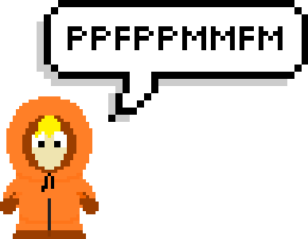
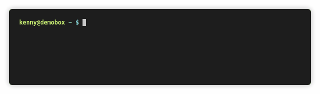

# kenny

> A kenny-speak en- and decoder

> "Ppfmfp ppmffm Mfmppfmpm! Fmpmfpmppffm pmpmffpmfpmfmppmpm Pmpmppppppppffm!"

[](https://github.com/particleflux/kenny/releases)
[](https://travis-ci.org/particleflux/kenny)
[](https://codecov.io/gh/particleflux/kenny)





## Usage

```
Usage: kenny [OPTION]... [FILE]
Kenny encode or decode FILE, or standard input, to standard output.

With no FILE, or when FILE is -, read standard input.

  -d, --decode          decode data
```

### Example

Working on STDIN:

```
$ echo 'Oh my God! They killed Kenny!' | kenny 
Ppfmfp ppmffm Mfmppfmpm! Fmpmfpmppffm pmpmffpmfpmfmppmpm Pmpmppppppppffm!
```

Encoding the contents of a file:

```
$ cat test.txt 
Hello World
$ kenny test.txt 
Mfpmpppmfpmfppf Fppppfpffpmfmpm
```

Decoding:

```
$ echo "pmpmppppppppffm" | kenny -d
kenny
```


## Installation

### Compiling from source

```
git clone https://github.com/particleflux/kenny.git
cd kenny
mkdir build && cd build
cmake ..
make
sudo make install
```

### Gentoo

There is an ebuild available in my [personal overlay]:

```
sudo layman -o https://github.com/particleflux/overlay/raw/master/overlay.xml -f -a particleflux-overlay
emerge -a kenny
```

## Running tests

```
make test
```

### With coverage

```
cmake -DCodeCoverage=ON ..
make coverage-html
```


[personal overlay]: https://github.com/particleflux/overlay